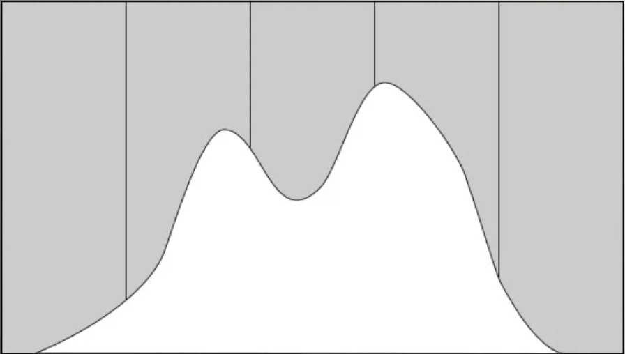

# ISO

ISO is the light sensitivity of your sensor, once you have adjusted the [aperture](aperture.md) and the [shutter speed](shutter-speed.md) to your need, this is the last setting to tweak.

The higher your ISO, the more noisy your picture will be, so you have to strike a balance.

To do that, you can rely on the histogram of your camera, taking a picture of the landscape, it should resolve in a bell curve slightly to the right like below.

You should avoid having spikes on the far left and far right of your picture in most situations.

