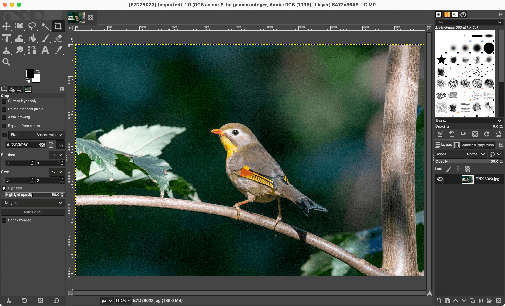

# GIMP

[GIMP](https://www.gimp.org/) is an open source photo editing software and Photoshop alternative.


Pros:

* Free
* Runs on any platform
* Open source



Cons:

* Cannot edit RAW without a complementary software like [Darktable](darktable.md)
* Not as feature complete as Photoshop


