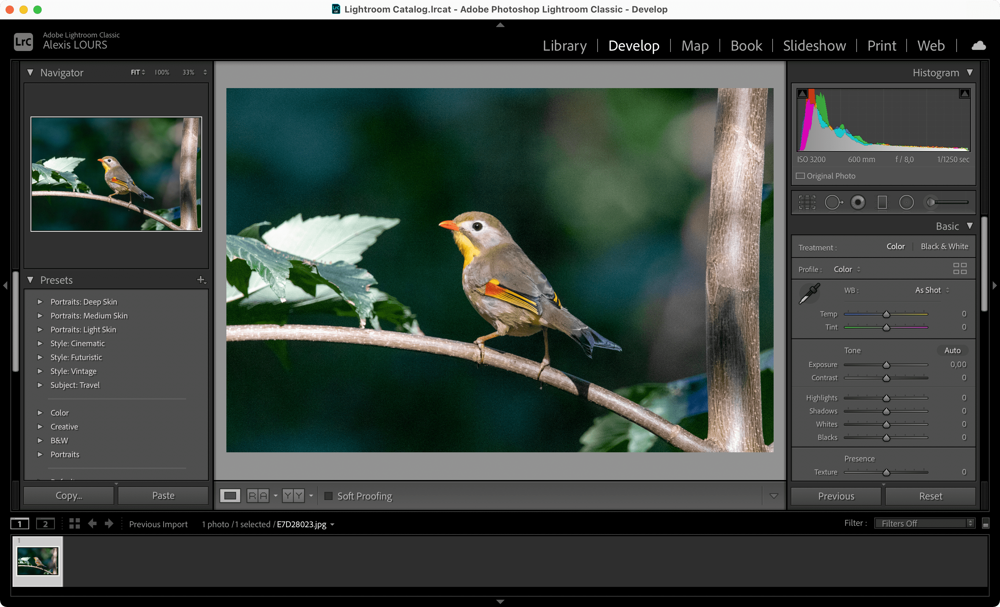

# Lightroom Classic

[Lightroom Classic](https://www.adobe.com/products/photoshop-lightroom-classic.html) is the  RAW developer software made by Adobe.


Pros:

* Easy to use
* Easy library management



Cons:

* Most features are available in Photoshop
* Paid and in a subscription model


