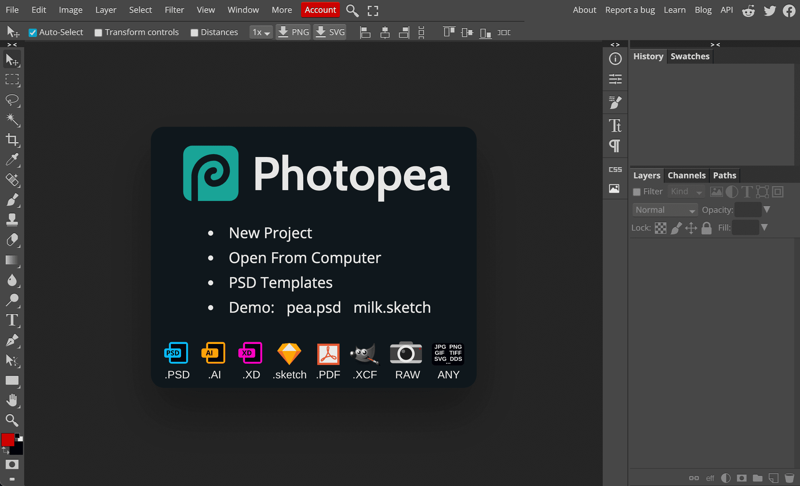

# Photopea


Pros:

* Free
* Runs on any platform



Cons:

* Limited RAW editing
* Not as feature complete as Photoshop


[Photopea](https://www.photopea.com/) is an online site with a UI fairly similar to Photoshop which also allows basic RAW editing in the browser. 

It's a great alternative in case you only have a Chromebook or can't install software.

