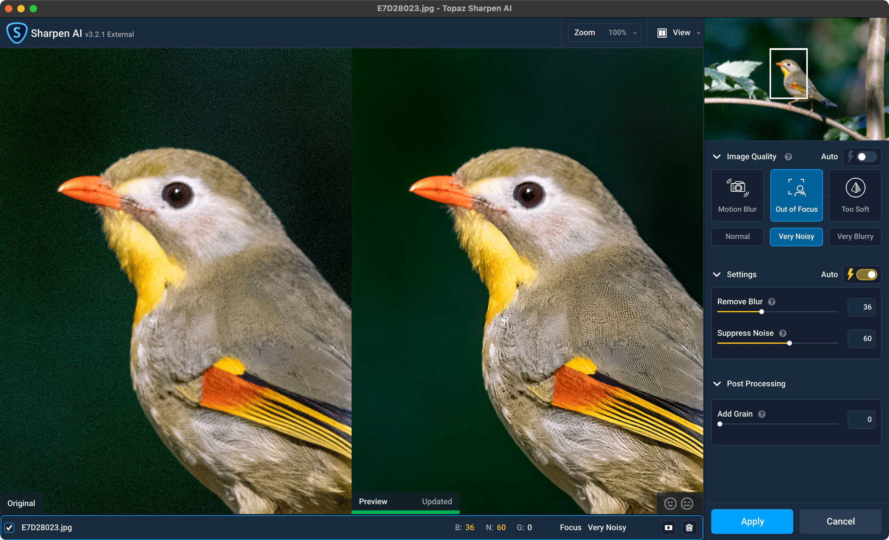
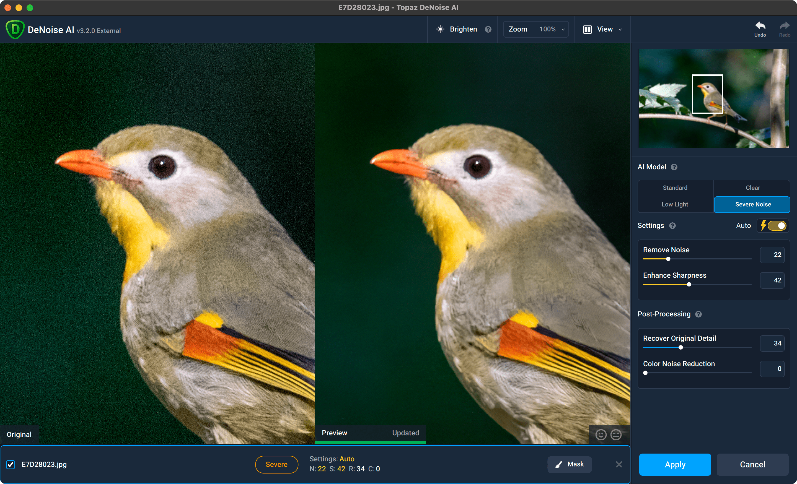

# Topaz Labs

Topaz Labs is a company famed for making software that uses AI to enhance pictures.

Their two key products for bird photography are [Sharpen AI](https://www.topazlabs.com/sharpen-ai) and [DeNoise AI](https://www.topazlabs.com/denoise-ai).

### Sharpen AI

Sharpen AI specialises in Sharpening pictures and can fix soft pictures to some extent.

### DeNoise AI

DeNoise AI focuses on noise removal, which can be handy for some lowlight pictures.


Both software can do the other's job to some extent. DeNoise AI can enhance sharpening a bit and Sharpen AI can remove light noise.


