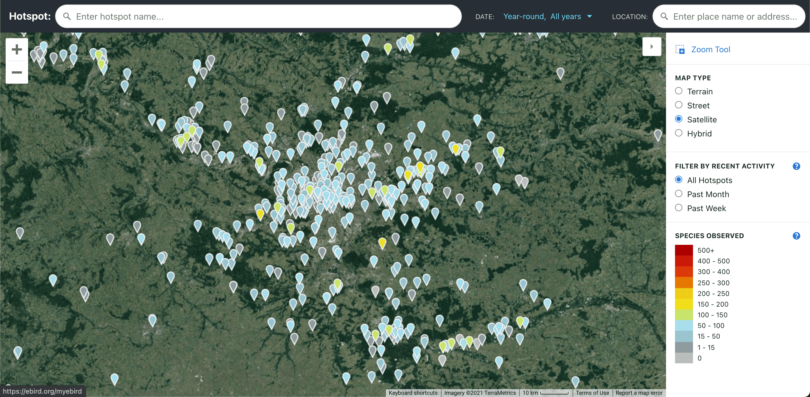
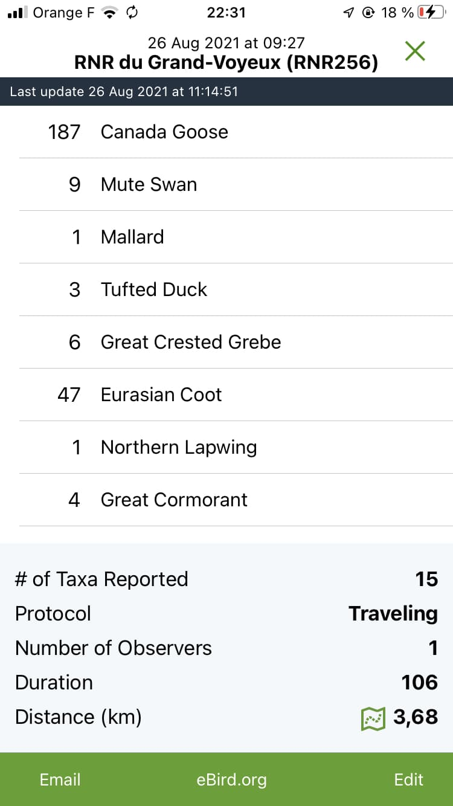

# eBird

[eBird](https://ebird.org/) is the most popular birding site out there. It has many features that can be beneficial to photographers too.

### Maps

Their hotspot and species map helps knowing where to look for birds.

You can also report your own sighting and pictures of them to contribute to this data.

### Mobile app

The eBird mobile app allows users to keep track of their current sightings during a session with checklists.

