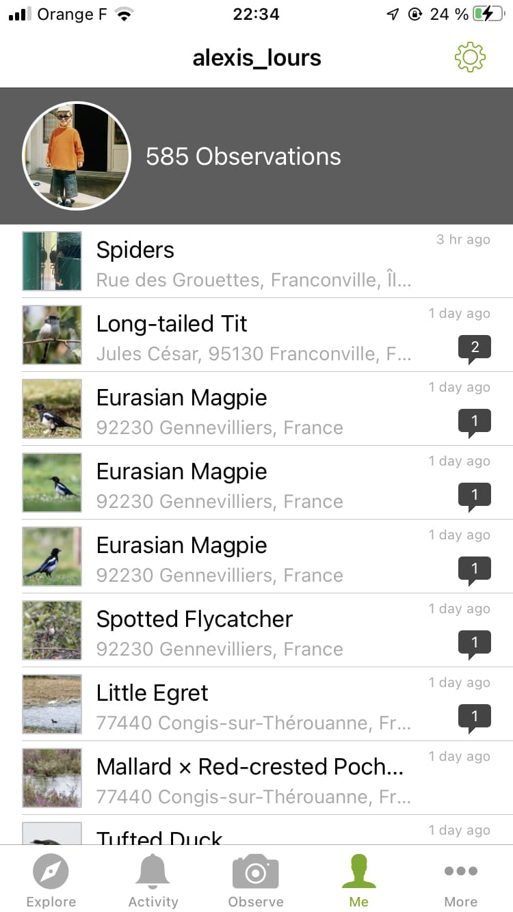

# iNaturalist

[iNaturalist](https://www.inaturalist.org/) is not a dedicated birding platform but bird observations are part of it.

Their website also includes a map, much like eBird.

### Mobile app

iNaturalist also has a mobile app from which you can include sightings.

 


Unlike eBird, observations must be with an audio recording or a picture to be accounted for.


