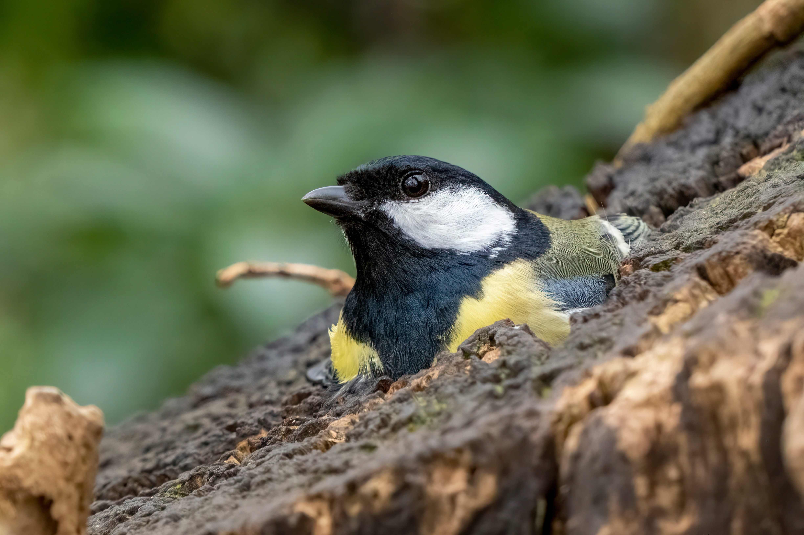
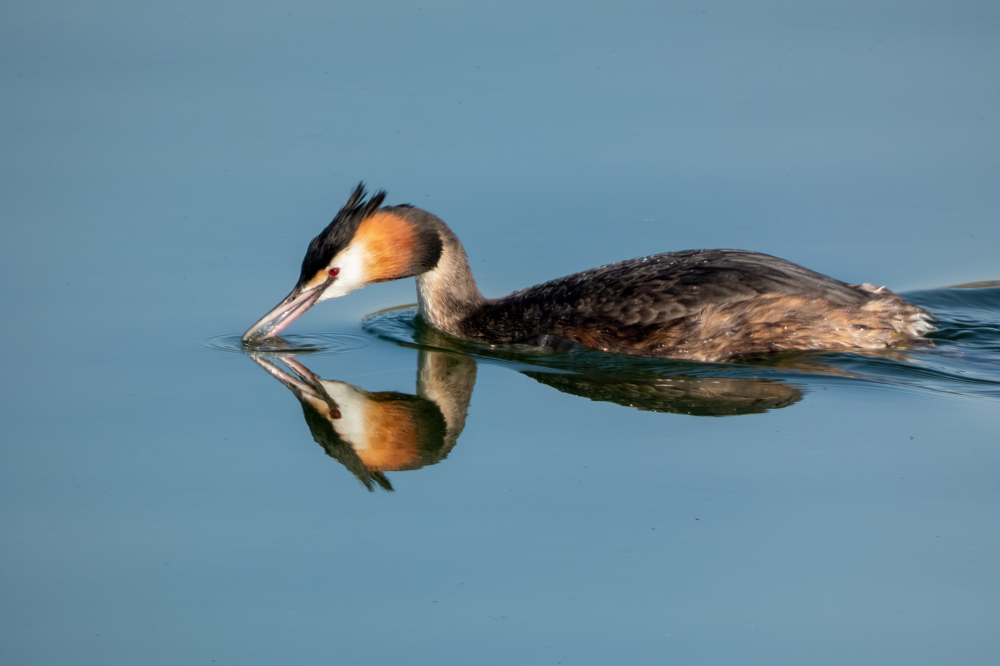

# Camera

### Choosing a camera

The hardest part for someone getting started is probably settling on a camera.

If you look online, you'll probably seen that most of the recommended camera are _**really**_ expensive. Photography is a costly passion, but you can still find fairly competent cameras for a relatively low price.

### Bridge cameras

Bridge cameras are probably the easiest entry product to bird photography. They are relatively cheap compared to DSLR and mirrorless cameras, allow for great zooms and make amazing video cameras but are not as flexible as a drawback: you are stuck with the built in lens. 

This doesn't mean that you can't get great pictures with them, but some situations will be relatively hard to capture \(birds in flight, low light\).

Another key advantage of bridges over other types of cameras is their weight. If you want to go on a hike, they can be up to 5 times lighter than a fully equipped DSLR.

#### Panasonic Lumix FZ-80/FZ-82

The Panasonic FZ-80 \(also known as the FZ-82 in some countries\) is the only bridge I used for an extended period of time. It is one of the cheapest option and can be found for around **$300** brand new and **$200** used. 

This camera has some flaws, mainly in low light, but for the price it's quite unbeatable for bird photo. It has a zoom of up to 1200mm full-frame equivalent quite can be really handy for bird photo. With a bit of editing, the pictures are also definitely useable as it can also shoot in [RAW](../camera-settings/image-format.md).

#### Nikon COOLPIX P950

Another popular bridge, the P950 is quite popular, boasting a crazy 2000mm zoom, it is not only good for taking pictures of perched birds but also as a way to observe them. I do not own a P950, but I have used it for half a day and it is definitely capable for photography.

### DSLRs

Probably the most popular option for long time bird photographers, the ability to change lens allows for a greater adaptability than bridges. They also allow for future upgradability. You could either start off with a cheap [lens](lens.md) and an expensive body or the opposite. 

The choice for DSLR is really wide, so I'll also only be listing two popular options.

#### Canon EOS 7D Mark II

This 2014 body from Canon can be found for relatively cheap on the used market \(~$600\) and makes for a fantastic value. This is the camera I currently use and I really don't feel held back by it at all.

#### Nikon D500

Another popular option, this camera is often praised for wildlife by Nikon users. I haven't personally tried it, but it should be a safe bet.

### Mirrorless

Mirrorless cameras are the new players in the field. Lighter, smaller, faster, they also have major drawbacks like weather sealing, battery life and cost. 

I won't recommend a mirrorless camera to someone getting started in bird photography because they have severe drawbacks that I think makes them unsuitable as the time of writing. If you want to buy one \(and have the means to\), sure, go ahead, but make sure to look up these issues.

