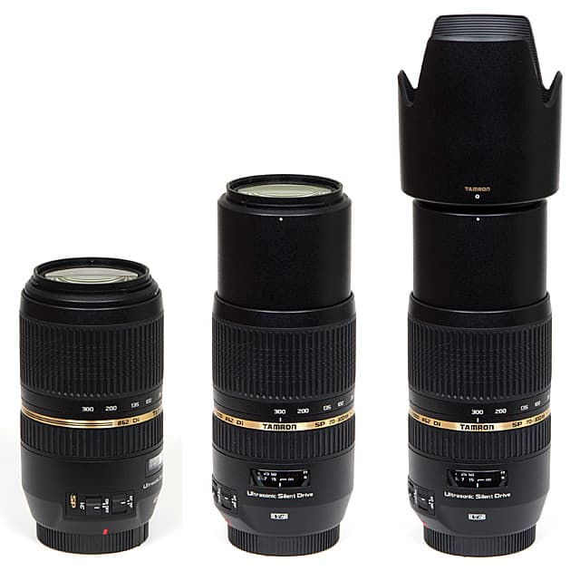
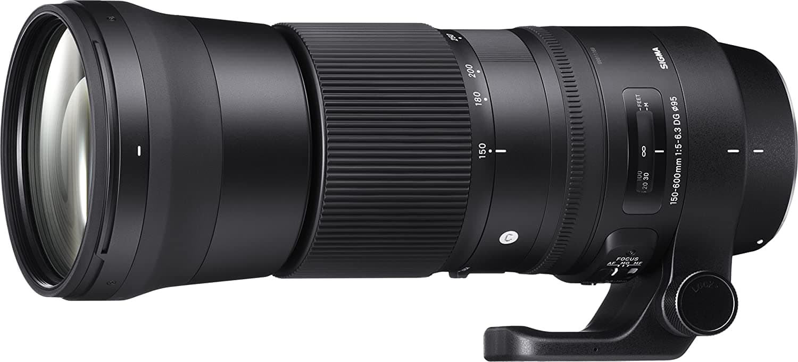
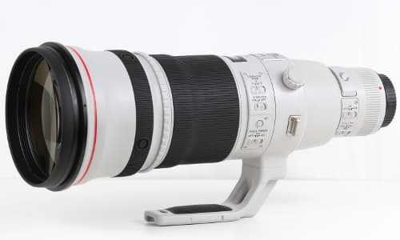

# Lens

### Choosing a lens

If you picked a DSLR or a mirrorless, your second choice is going to be your first lens. Lens come in a price range and focal length.


Avoid cheap lenses boasting really high focal length for very low prices, these lens are often unusable in the field and of very poor quality.


### Zoom lenses

Zoom lenses have a variable focal length, they are most of the time cheaper than prime lens but sacrifice minimal aperture and sharpness to the cost of flexibility.

Beginners will most likely be interested in 300mm and 400mm zoom lens as these are relatively inexpensive. 

####  Tamron SP AF 70-300 F/4-5.6 Di VC USD

The [Tamron SP AF 70-300 F/4-5.6 Di VC USD](https://www.tamron.eu/lenses/sp-af-70-300-f4-56-di-vc-usd/) \(yes, this is a mouthful\) can be found for around $200. It comes with a lens hood and has a focal range of 70 to 300mm. These cheap lens often have problems with chromatic aberrations, such as [purple fringing](https://en.wikipedia.org/wiki/Purple_fringing). These problems can often be corrected during [editing](../editing/editing.md).

#### Sigma 150-600mm F5-6.3 DG OS HSM Contemporary

The [Sigma 150-600mm F5-6.3 DG OS HSM Contemporary](https://www.sigma-global.com/en/lenses/c015_150_600_5_63/) is probably the most popular zoom lens for more advanced photographer. It is the cheapest \(~$900\) of the 600mm zoom lenses and offers a great zoom for good bird pictures.

### Prime lenses

The high end of lenses, unlike the zoom lenses, these come with a fixed aperture. A good example of these is [Canon EF 500mm f/4L IS II USM](https://store.canon.co.uk/canon-ef-500mm-f-4l-is-ii-usm-lens/5124B005/). These lens are bigger and more expensive than their zoom lens equivalent and probably shouldn't be used by most people. The lens mentioned before retails for around $10,000.

