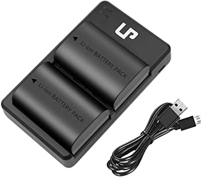
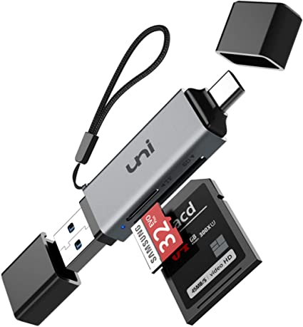

# Misc.

### Batteries

Spare batteries are often a must if you want to go out all day. 


Don't be afraid of buying third party batteries for camera, these can often be slightly better than the stock ones for a lower price, just make sure to check the reviews first!


### Battery chargers

Much like batteries, third party battery chargers are often great options and can allow to charge multiple batteries at once.

### Battery banks

Going hand in hand with battery chargers, battery bank can allow you to top up on the go. They can also allow you to charge your phone on the field if you use it to keep track of the birds you saw or just a [safety](../preparation/safety.md) measure.

I've been using a 20,000 mAh battery from [Anker](https://us.anker.com/) for the last 5 years and so far haven't had a single issue with it.

### Camera strap

A camera strap, especially a shoulder one, can be really practical to reduce weight on your neck.

### SD Adapter

Having a small SD to USB adapter can come in handy when you want to export your pictures from your camera. 

I bought the following one for $15 and it has two ends: one for USB-C and one for USB and accepts Micro SD and regular SD cards.

