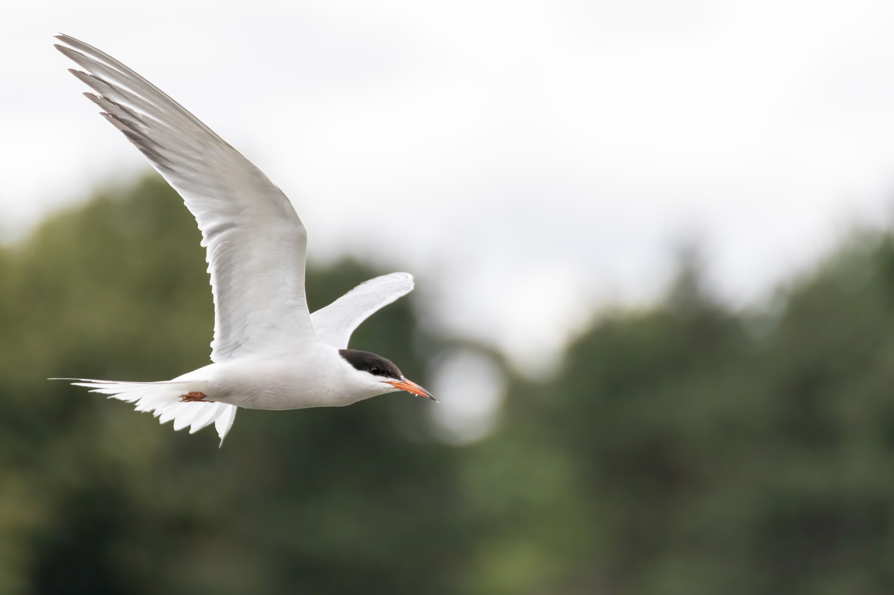

# Birds in flight

Capturing a bird in flight can range from being easy to really complicated. There is no theory to it, you have to train to capture them in flight.

The best training targets at the beginning are probably pigeons and gulls as these are quite common and fairly slow flyers.

Swallows also make for amazing training with their erratic flight patterns.

