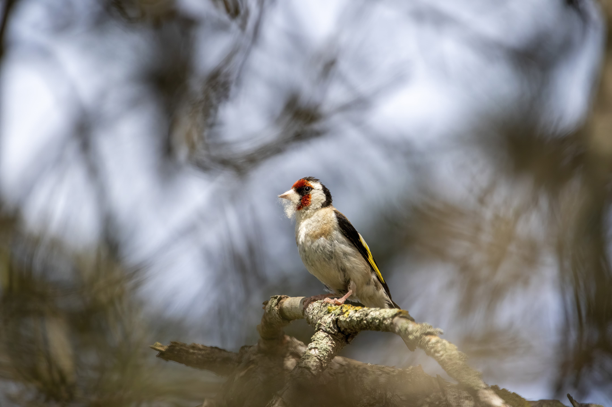

# Getting the right angle

Getting the right angle is probably one of the most important thing to do to step up your bird photography.

The best approach is to get eye level with the bird.  
This can be complicated for birds in trees, but getting low can dramatically change how a picture looks and can be done in most situations.

