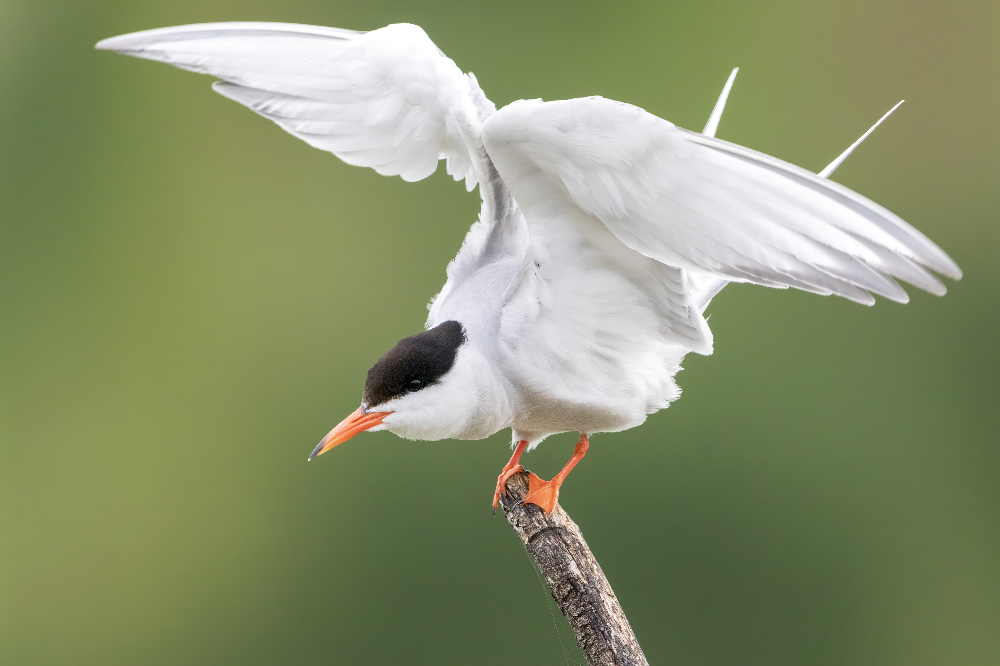
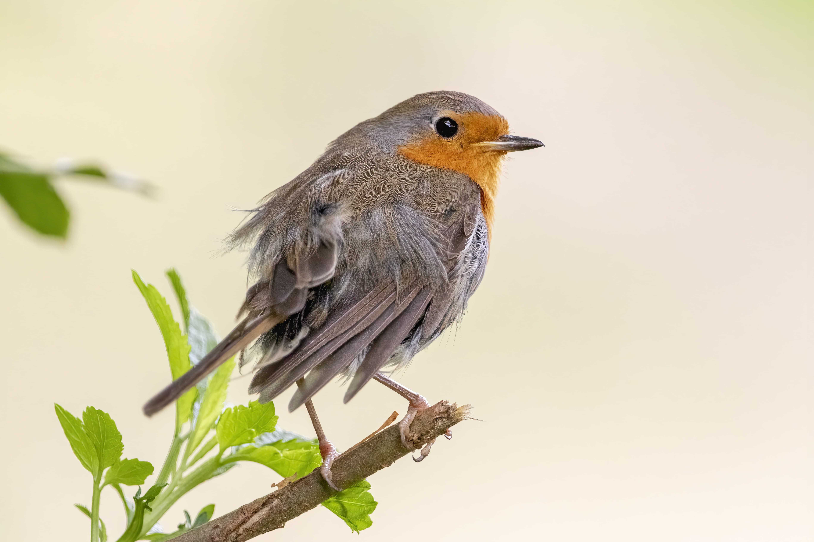

# Smooth background

Most bird photographers aim for smooth and uniform backgrounds. These backgrounds are fairly easy to reproduce given the right circumstances.

### Finding the perch

The first step is to find a nice looking perch on which the bird can land. Most of the pictures you will see on line with these are staged and made with artificial perches. This doesn't mean that these shots are impossible to get in the wild.

### Wide open

To get these out of focus backgrounds, you need to shoot as wide open as you can to increase the blur.  
The background also needs to be as far as possible on telephoto lens.

